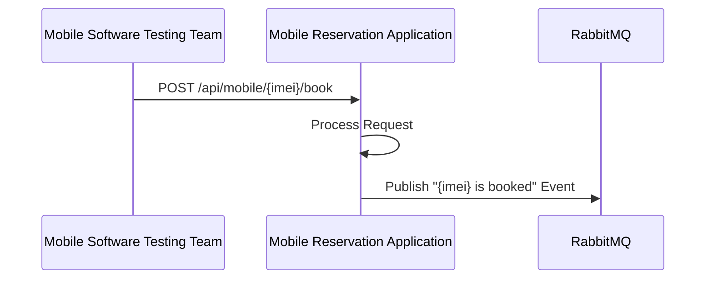
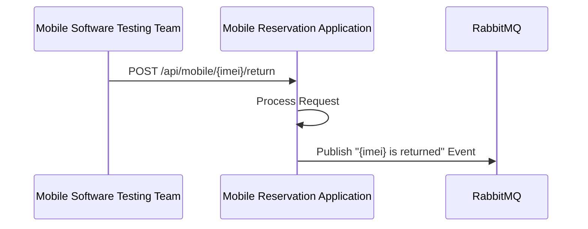

<h1 align="center"> Mobile Phone Reservation</h1> <br>

<p align="center">
The mobile phone reservation enabled the software testing team to reserve and retrun mobile phones for testing
purposes.</p>


## Table of Contents

- [Introduction](#introduction)
- [Features](#features)
- [Code Dependencies](#code-dependencies)
- [Requirements](#requirements)
- [Configuration](#configuration)
- [Running](#running)
- [Testing](#testing)
- [Reflection](#reflection)

## Introduction

The mobile software testing team has 10 mobile phones that it needs to share for testing
purposes.
- Samsung Galaxy S9
- 2x Samsung Galaxy S8
- Motorola Nexus 6
- Oneplus 9
- Apple iPhone 13
- Apple iPhone 12
- Apple iPhone 11
- iPhone X
- Nokia 3310

## Features
This project includes the following features:
- Using Java
- Authentication for controller api calls
- A Contoller service that allows a phone to be booked / returned.
- A RabbitMQ notification to a message broker when a phone is either booked or
  returned
### Booking a Mobile Phone Flow

### Returning a Mobile Phone Flow


## Code Dependencies

### Source Code Dependencies

The following dependencies are used in the source code of the project:

- [Spring Boot](https://spring.io/projects/spring-boot): Framework for building production-ready applications.
- [Spring Data JPA](https://spring.io/projects/spring-data-jpa): Simplifies database access with JPA.
- [Spring AMQP](https://spring.io/projects/spring-amqp): Provides integration with RabbitMQ for messaging.
- [Lombok](https://projectlombok.org/): Library for reducing boilerplate code in Java classes.
- [Slf4j](http://www.slf4j.org/): Simple Logging Facade for Java, used for logging.
- [Hibernate Validator](https://hibernate.org/validator/): For bean validation. 

### Unit Test Dependencies

The following dependencies are used for unit testing:

- [JUnit](https://junit.org/junit5/): Testing framework for Java.
- [Mockito](https://site.mockito.org/): Mocking framework for unit tests.
- [TestContainers](https://www.testcontainers.org/): Library for managing external dependencies in tests (e.g., RabbitMQ).
- [Spring Boot Test](https://docs.spring.io/spring-boot/docs/current/reference/html/spring-boot-features.html#boot-features-testing): Provides support for testing Spring Boot applications.

These dependencies enable effective testing, integration, and management of the project's functionality.

## Requirements
The application can be run locally or in a docker container, the requirements for each setup are listed below.


### Authentication
For the purpose of this test a hard coded/in memory list of users were created. The Contoller expects basic authentication.
- User 1:
  - **Username**: user
  - **Password**: password
  - **Role**: USER
- User 2:
  - **Username**: user2
  - **Password**: password
  - **Role**: USER 


In a production system this approach is not valid and platforms which implement OAuth2 authentication should be used like [Keycloak](https://www.keycloak.org/)

## Configuration 

The `application.yml` file contains various configuration settings for the Mobile Phone Reservation application. Below are explanations of some key configuration sections that you may need to customize according to your setup.

### Database Configuration

The application uses an H2 in-memory database for demonstration purposes.
- data.sql is also present with containing the phones to be loaded on startup.

### RabbitMQ Configuration
The application uses RabbitMQ for event communication. Configure the RabbitMQ connection settings as follows:
```yaml
spring:
  rabbitmq:
    host: rabbitmq   # RabbitMQ host name or IP address
    port: 5672       # RabbitMQ port
    username: guest  # RabbitMQ username
    password: guest  # RabbitMQ password
```
Custom Configuration (Exchange Names)
The configuration also includes custom settings for exchange names used in the application:
```yaml
mobile-phone-reservation:
  exchange-names:
    book-phone-exchange: book-phone-exchange
    return-phone-exchange: return-exchange
```
## Running

### Local
* [Java 17 SDK](https://www.oracle.com/java/technologies/downloads/#java17)
* [Maven](https://maven.apache.org/download.cgi)

```ssh
mvn spring-boot:run
```

### Docker
* [Docker](https://docs.docker.com/engine/install/)

This repository contains the Dockerfile and necessary configuration to containerize the Mobile Phone Reservation application.

#### Build Docker Image

To build the Docker image for the Mobile Phone Reservation application, follow these steps:

1. Open a terminal window and navigate to the root directory of this project.

2. Run the following command to build the Docker image:

   ```sh
   docker build -t mobile-phone-reservation-app .
   ``` 
    This will create a Docker image named mobile-phone-reservation-app based on the Dockerfile provided.

#### Run Docker Container
Once the Docker image is built, you can run a Docker container to host the Mobile Phone Reservation application:

- Run the following command to start the Docker container:
   ```sh
  docker run -d -p 8080:8080 --name mobile-app-container mobile-phone-reservation-app  --spring.config.location={path}/application.yaml

1. This will start a Docker container named mobile-app-container based on the image you built.

2. The application will be accessible on http://localhost:8080.

### Docker Compose with RabbitMQ Setup

This repository contains the Docker Compose setup for deploying the Mobile Phone Reservation System along with RabbitMQ.

Follow these steps to deploy the Mobile Phone Reservation System and RabbitMQ using Docker Compose:

1. Clone this repository to your local machine:

   ```bash
   git clone https://github.com/mematthew/Mobile-Phone-Reservation.git

 
2. Navigate to the project directory:

   ```bash
   cd mobile-phone-reservation
   ```

3. Start the services using Docker Compose:

    ```bash
    docker-compose up -d --build
    ```
    
    This will start RabbitMQ and the Mobile Phone Reservation System containers in the background.

4. Access the Mobile Phone Reservation System:
   http://localhost:8080. You can make API requests to interact with the system.

5. Access RabbitMQ Management UI:
RabbitMQ's management interface will be available at http://localhost:15672. You can log in using the default credentials (guest/guest).

Notes:
- RabbitMQ data persistence is maintained using Docker volumes.
- Logs generated by the Mobile Phone Reservation System are stored in the logs directory.
- Configuration files are placed in the conf directory.
- The docker-compose.yml file defines the services and network setup.
  - The backend and frontend networks facilitate communication between the services.

## Testing
A postman collection has been attached to the project for testing. (Mobile Phone Reservation.postman_collection.json)


## REFLECTION

### What aspect of this exercise did you find most interesting?
One of the most interesting aspects of this exercise was discovering and using TestContainers. I had always wanted to explore TestContainers for managing external dependencies in tests, and this project provided a perfect opportunity to do so. Moreover, the exercise triggered ideas for implementing various additional functionalities. For instance, I considered incorporating Hibernate Envers for auditing, experimenting with Chaos Monkey for testing resilience, providing additional controller functionality to manage and query phones.

Additionally, the approach taken for events, which currently uses a simple string, could be further enhanced. Ideally, using a more structured format like Google Protocol Buffers (protobuf) would allow for additional details such as user, time, and IMEI to be included in separate fields. This would make the consumer easier to read and parse.

### What did you find most cumbersome?

I have to admit that due to my current role, it's been a while since I wrote unit tests, and it did take some time to ramp up. However, this experience also served as a valuable opportunity to refresh my knowledge. I valued the opportunity to enhance my skills and expand my knowledge as I engaged in this exercise.


